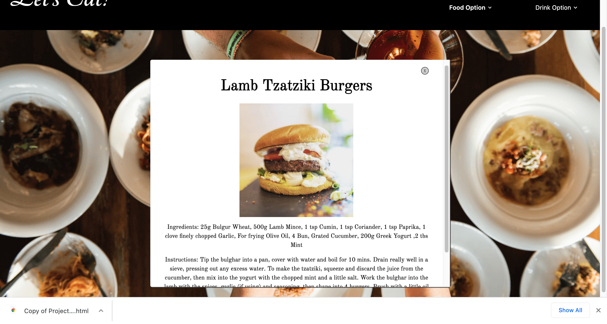
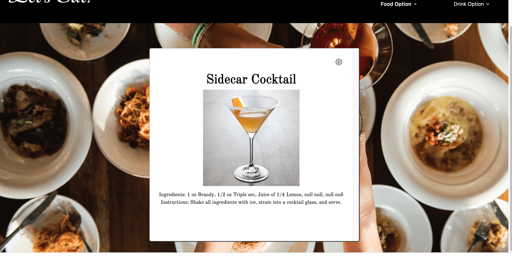

# Lets Eat
Project 1 

## Table of Contents

* [Overview](#overview)
* [Built With](#builtwith)
* [Contributers](#contributers)
* [Usage](#usage)
* [Credits](#credits)
* [License](#license)

## Overview
Let's Eat is an application that utilizes a combination of VS Code, HTML, CSS, Javascript, Tailwind,and Jquery. The team developed this application that allows the user to pick whether they would like a drink or food recipe at the top of the page. The user will then have the option to  choose what ingrident from a food or drink category. Once the ingredient or a category has been chosen the application will return a random recipe from an API that will contain the ingredient or category the user selected.  The application calls on two different API's. The API we selected for food recipes is the TheMealDB and the API that returns drink recipes is TheCocktailDB.

## Built With
* VS Code
* HTML
* CSS
* Tailwind
* Javascript
* Jquery
* TheMealDB API (https://www.themealdb.com/api.php)
* TheCocktailDB API (https://www.thecocktaildb.com/api.php)

## Contributers
1. https://github.com/kirmarnel Kirsten Nelson
2. https://github.com/j-toups Joesph Toups
3. https://github.com/MarisaHanna Marisa Hanna
4. https://github.com/Ofarrell23 Keya Bernhardt

## Usage 

## Credits

Below is a list of third-party tutorials used to help facilitate this project. There were no collaborators for this project.

* [Credits] (https://www.w3schools.com/tags/att_img_alt.asp)
* [Credits] (https://www.vikingcodeschool.com/html5-and-css3/html5-semantic-tags)
* [Credits] (https://developer.mozilla.org/en-US/docs/Web/JavaScript)
* [Credits] (https://tailwindcss.com/docs/installation)
* [Credits] (https://www.jqueryscript.net/)

## License

[https://choosealicense.com/licenses/gpl-3.0/](https://choosealicense.com/licenses/gpl-3.0/) 

